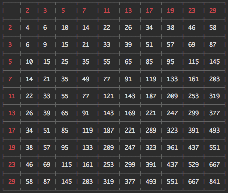

## Synopsis

This project is a interview project. The requirements were as follows: 

* Write a program that prints out a multiplication table to the nth prime number

* Consider scale and complexity.

* Write test and demonstrate TDD.

### DEMO

## Installation / Environment

This project was built on

* Node v6.3.1

* install dependencies `npm install`

* install cli globally `sudo npm install -g`

## Running

After you have installed the global cli command, which is `run-table` type the command with `n` prime table you want

NOTE: if you don't want to globally install the command you can replace `run-table n` with `Node run.js n`. However, please be in the root directory when you do this.

e.g

`run-table 10`

will output to

## Logic 

I initially thought to create a, isPrime function, that iterated through the numbers up to n and checked to see if the number was divisible at any point. This would have been about 0(n2) time complexity. However, I did some research and found Sieve of Eratosthenes formula that generated prime numbers in order at O(n * log(log(n))). This made the prime function generation incredibly fast. One issue with this apporach was that the stated problem's input should be the nth prime number, rather than the arbitrary number. 

e.a I need to generate 10 prime numbers, vs find me all prime numbers up to 10 

I solved this issue using Prime Number Theorem's estimation for finding the nth Prime number in constant time. I did add a padding to the estimation to remove potential errors from the estimation. 

## Tests

run tests `npm test`

## License

A short snippet describing the license (MIT)
